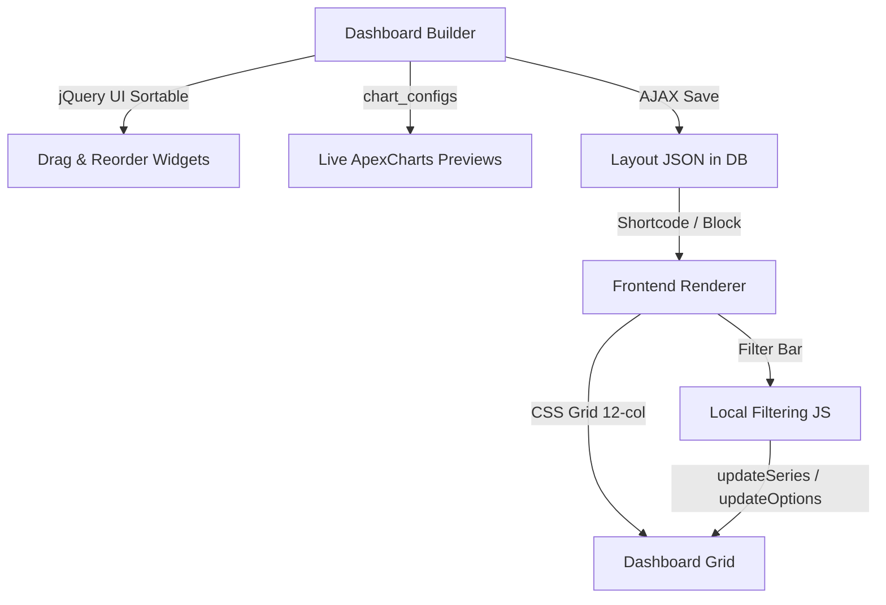

# Phase 4 Walkthrough — Dashboard System

## What Was Built

Enhanced the dashboard system with **drag-to-reorder (jQuery UI Sortable)**, **live ApexCharts previews** inside the admin builder, and a **local filtering system** (date range + category dropdown) on the frontend — all without external dependencies.

## Architecture

## Changes Made

### Modified Files

| File | Changes |
|------|---------|
| [class-accelvia-df-admin.php](file:///d:/AI/Accelvia%20DataForge%20–%20Charts%20&%20Dashboards%20for%20WordPress/admin/class-accelvia-df-admin.php) | Enqueue `jquery-ui-sortable` (WP core). Pass `chart_configs` to localized data for live previews. |
| [accelvia-df-admin.js](file:///d:/AI/Accelvia%20DataForge%20–%20Charts%20&%20Dashboards%20for%20WordPress/admin/assets/accelvia-df-admin.js) | Complete `initDashboardBuilder()` rewrite: Sortable init, live `renderWidgetPreview()`, chart destroy on remove/resize, drag handle icon. |
| [accelvia-df-admin.css](file:///d:/AI/Accelvia%20DataForge%20–%20Charts%20&%20Dashboards%20for%20WordPress/admin/assets/accelvia-df-admin.css) | Sortable placeholder, drag handle, live preview container, dark grid colors, hover/drag states, shimmer skeleton. |
| [class-accelvia-df-public.php](file:///d:/AI/Accelvia%20DataForge%20–%20Charts%20&%20Dashboards%20for%20WordPress/public/class-accelvia-df-public.php) | `enqueue_dashboard_assets()`, filter bar HTML (date range + category dropdown + reset), theme class on wrapper, category extraction from all charts. |

### New Files

| File | Size | Purpose |
|------|------|---------|
| [accelvia-df-dashboard.css](file:///d:/AI/Accelvia%20DataForge%20–%20Charts%20&%20Dashboards%20for%20WordPress/public/assets/accelvia-df-dashboard.css) | 4.4KB | Frontend responsive grid, filter bar (light/dark), mobile breakpoints |
| [accelvia-df-dashboard.js](file:///d:/AI/Accelvia%20DataForge%20–%20Charts%20&%20Dashboards%20for%20WordPress/public/assets/accelvia-df-dashboard.js) | 9KB | Multi-chart renderer, local date/category filtering via `updateSeries()` |

## Key Features

### Admin Dashboard Builder
- **jQuery UI Sortable** — Drag widgets by their header to reorder within the 12-column CSS grid
- **Live ApexCharts** — Each widget shows a real mini-chart preview (200px height, no toolbar)
- **Smart Resize** — Changing column span destroys and re-renders the chart to fit the new width
- **Drag Handle** — Move icon (`dashicons-move`) in the widget header for visual affordance
- **Sortable Placeholder** — Dashed indigo border shows drop position during reorder

### Frontend Dashboard
- **12-column CSS Grid** — Responsive: collapses to 6-col on tablets, full-width on mobile
- **Filter Bar** with three controls:
  - **Date From / Date To** — Filters X-axis categories that match date-like strings (ISO dates, "Jan", "Feb 2024", etc.)
  - **Category Dropdown** — Populated from all chart labels, filters by substring match
  - **Reset Button** — Restores all charts to their original data
- **Zero-reload filtering** — Uses ApexCharts `updateSeries()` and `updateOptions()` for smooth animated transitions
- **Theme support** — `[accelvia_dashboard id="1" theme="dark"]` applies dark styling to the entire dashboard + filter bar

## Security

- No new database queries — uses existing `Accelvia_DF_DB` CRUD methods
- All output properly escaped with `esc_html()`, `esc_attr()`, `esc_html_e()`
- jQuery UI Sortable is bundled with WordPress core — zero external downloads

## Verification

- ✅ PHP syntax check: **15/15 files pass** with zero errors
- ✅ File structure: **35 files** across the plugin confirmed
